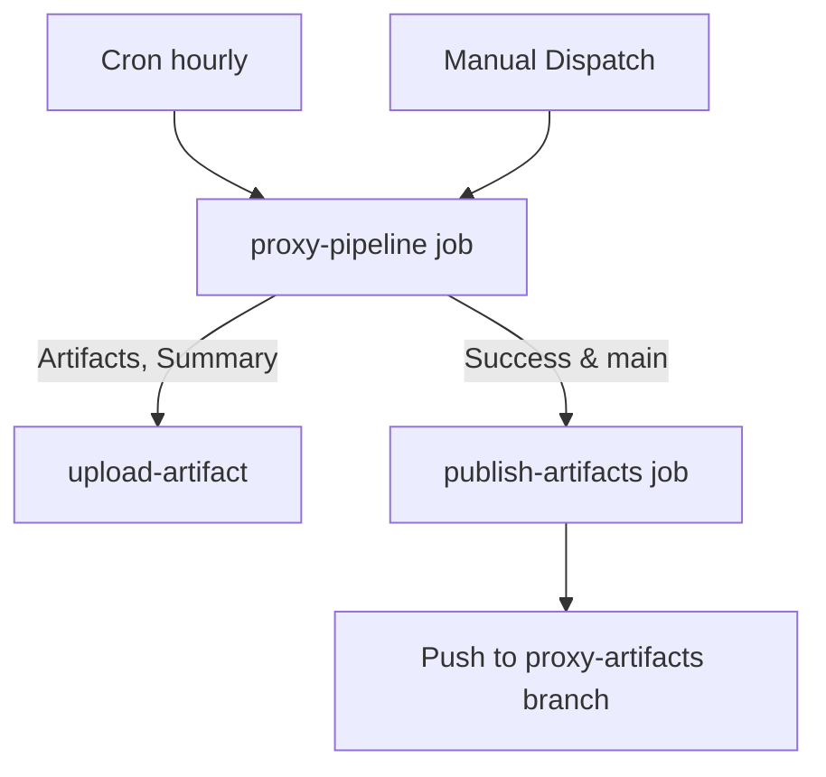
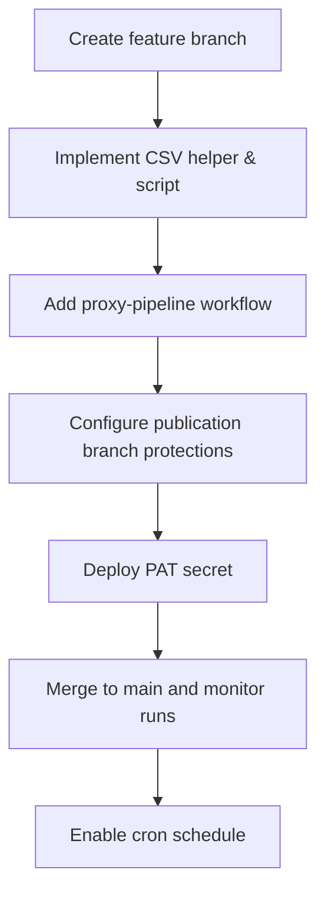

# Technical Design

## Overview
This design introduces GitHub Actions automation that executes the Mullvad relay pipeline on a schedule and on demand, generates JSON, CSV, and plain-text proxy lists from the same source snapshot, verifies optional samples, and publishes artifacts for downstream consumption. The workflows reuse the existing Python pipeline and verification tooling, add a deterministic CSV exporter, and push release-grade outputs to a dedicated publication branch when `main` runs succeed.

## Feature Classification
- **Type:** Extension of existing pipeline execution with new CI/CD automation.
- **Scope Adaptation:** Reuse current build scripts, add minimal helpers (CSV writer, publication script), and configure GitHub workflows for orchestration, observability, and artifact lifecycle.

## Traceability
| Requirement | Design Coverage |
|-------------|-----------------|
| R1 Workflow Orchestration | Sections “Workflow Topology”, “Workflow Inputs”, “Concurrency Control”. |
| R2 Multi-Format Artifact Generation | Sections “Artifact Production”, “CSV Export Helper”, “Verification Execution”. |
| R3 Distribution and Retention | Sections “Artifact Publication” and “Retention Policy”. |
| R4 Observability and Guardrails | Sections “Logging & Summaries”, “Secret Validation”, “Risk Controls”. |

## Workflow Topology
Two jobs within a single workflow definition coordinate pipeline execution and publication.

- **Workflow file:** `.github/workflows/proxy-pipeline.yml`.
- **Triggers:** `schedule` at the start of every hour and `workflow_dispatch` with optional filter inputs.
- **Concurrency:** `concurrency: { group: mullvad-relay-pipeline, cancel-in-progress: false }` ensures new invocations queue until the active run finishes, satisfying R1.3.

## Job Breakdown
### Job `proxy-pipeline`
- **Runs-on:** `ubuntu-latest`.
- **Key steps:**
  - Checkout repository with full history (`fetch-depth: 0`) to support publishing job.
  - Install UV tooling via `astral-sh/setup-uv@v2` and restore dependencies (`uv sync`).
  - Resolve workflow inputs to CLI flags, writing them into `workflow.env` for reuse.
  - Execute `uv run python build_relay_list.py` with flags derived from schedule or dispatch inputs. Default scheduled run uses production configuration (`--no-cache`, `--verbose`, `--output-dir build`).
  - Convert JSON artifact to CSV via `uv run python scripts/export_relays_csv.py build/mullvad_relays.json build/mullvad_relays.csv` (new helper described below).
  - Optionally run verification when dispatch input `verify` is true by invoking `uv run python scripts/verify_proxies.py --json build/mullvad_relays.json --limit 10`.
  - Package outputs (JSON, CSV, text, PAC, canonical JSON when enabled) and upload using `actions/upload-artifact@v4` with `retention-days: 7`.
  - Append workflow summary using `actions/github-script@v7` that links artifacts, lists filter parameters, and notes verification status.

### Job `publish-artifacts`
- **Needs:** `proxy-pipeline` and runs only when `github.ref == 'refs/heads/main'` and prior job succeeded.
- **Responsibilities:**
  - Download artifacts with `actions/download-artifact@v4`.
  - Checkout repository with `persist-credentials: false`, then fetch and switch to publication branch `proxy-artifacts` (created if missing).
  - Replace tracked artifacts (`relays.json`, `relays.csv`, `relays.txt`, `relays.pac`) and generate a timestamped `manifest.json` summarizing the run metadata.
  - Configure git author (`github-actions[bot]`) and force-push updates using a fine-scoped PAT stored as `GH_PUBLISH_TOKEN` secret. Guardrails prevent accidental pushes when the secret is absent (job fails with clear log).
  - Emit URLs for raw files (e.g., `https://raw.githubusercontent.com/<org>/<repo>/proxy-artifacts/relays.json`) into the job summary.

## Workflow Inputs
- `countries` (string, optional): space-separated list fed into `--countries`.
- `providers_allow` (string, optional): comma-separated list passed to `--providers-allow`.
- `limit` (number, optional): forwarded to `--limit`.
- `verify` (boolean, default `false`): toggles verification step.
- `emit_canonical` (boolean, default `false`): toggles `--emit-canonical-json` flag.

Manual dispatch sanitizes inputs and logs chosen parameters to satisfy observability requirements.

## Artifact Production
- JSON and text artifacts are produced by existing writers in `mullvad/output.py`.
- Add new helper `write_csv` that serializes enriched relays into a tabular schema (`hostname`, `ip`, `city`, `country`, `socks5_endpoint`, `provider`). This helper lives in `mullvad/output.py` and is invoked by a new CLI flag `--emit-csv` or via standalone script.
- Introduce `scripts/export_relays_csv.py` wrapper that loads generated JSON, selects deterministic column order, and writes CSV; workflow uses this script until CLI flag is available.
- Ensure all artifacts are stamped with run metadata in `build/manifest.json` for troubleshooting.

## Verification Execution
- Verification step uses existing `scripts/verify_proxies.py` with default Binance endpoints.
- When verification fails, the step exits non-zero; job summary captures failure logs, enforcing R2.3.
- Scheduled runs set `verify-limit` to `5` and `verify` flag to `true` for lightweight assurance without exceeding runtime budgets.

## Artifact Publication
- Publication branch `proxy-artifacts` retains latest successful outputs; only last commit kept (`git push origin HEAD:proxy-artifacts --force-with-lease`).
- Artifacts remain available via raw GitHub URLs and by downloading workflow artifacts with seven-day retention.
- Workflow summary includes branch commit SHA and artifact URLs to meet R3.1 and R3.2.

## Logging & Summaries
- Each major pipeline stage logs start/end timestamps (`echo "::group::Stage"` usage for grouping). Summary step writes markdown bullet list covering: relay count, filters, verification outcome, artifact links.
- Failures bubble up using `set-output`? (No; use `$GITHUB_STEP_SUMMARY`). Missing secrets raise explicit errors before running pipeline, satisfying R4.2.

## Secret Validation
- Required secrets: `GH_PUBLISH_TOKEN` (repo `contents:write` scope). Optional `PROXY_CHECKER_LICENSE` when checker enabled.
- Workflow checks for `GH_PUBLISH_TOKEN` presence before publication and fails early if unset.

## Risk Controls
- **Concurrency:** GitHub concurrency group prevents overlapping runs.
- **Data integrity:** Publication job runs `sha256sum` on artifacts before and after branch commit to ensure no concurrent modifications.
- **Runtime limits:** Verification sample size capped and configurable.
- **Security:** Workflow uses short-lived token for artifact upload and PAT only within publish job.

## Testing Strategy
- **Unit:** Add tests for CSV export helper covering column ordering and empty dataset handling.
- **Integration:** Use a preview workflow triggered on pull requests (without publishing) to validate job definitions; include dry-run of publication logic by targeting a disposable branch.
- **End-to-End:** Execute manual dispatch in a staging repository to confirm artifact publication and summary formatting.
- **Monitoring:** Leverage workflow run history dashboards for cron success rates; add optional `workflow_run` notification integration later.

## Migration Strategy

- Implement helpers and workflow in feature branch.
- Request repository admin to create/push empty `proxy-artifacts` branch and add `GH_PUBLISH_TOKEN` secret before merging.
- Monitor first scheduled run; adjust cron or retention as needed.
