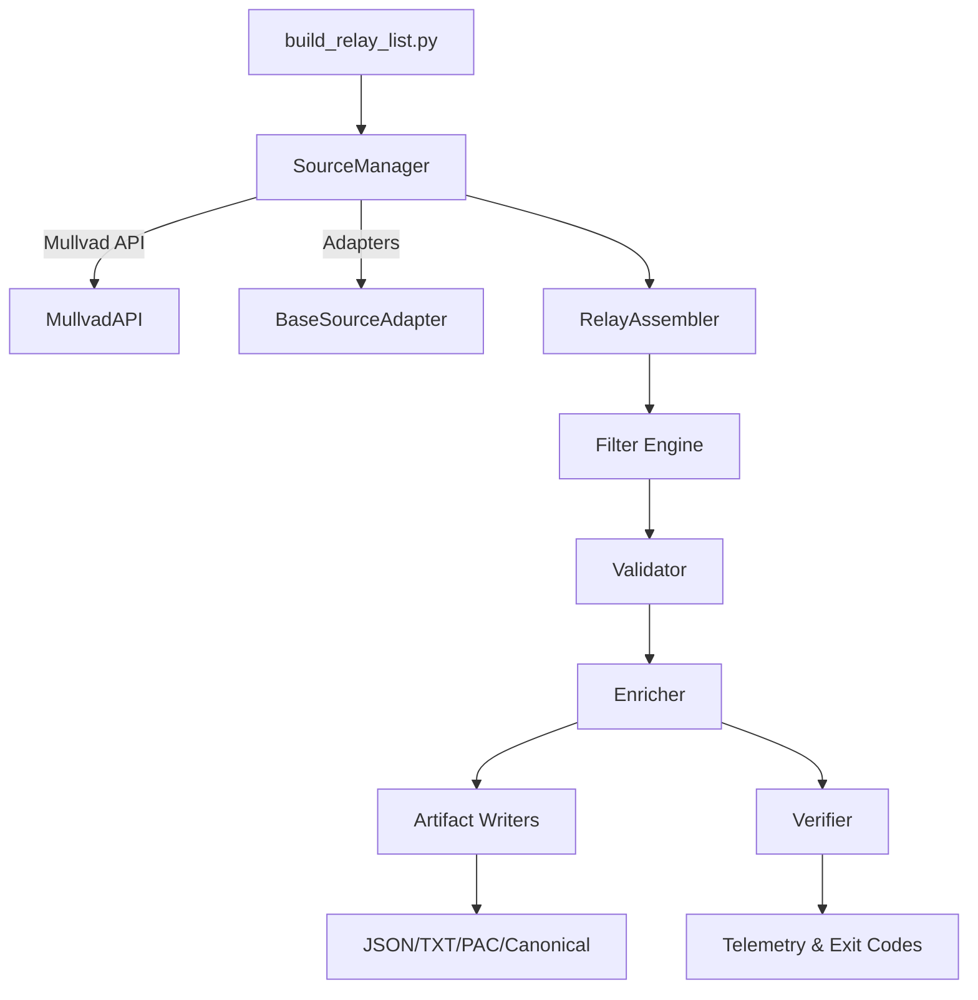
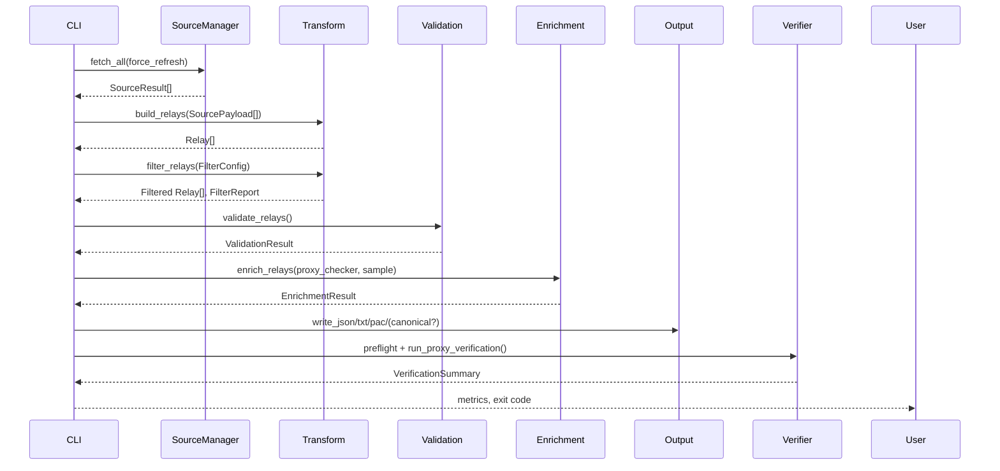

# Technical Design — pipelines-proxy-enrichment

## Feature Classification
- **Type:** Extension of the existing Mullvad relay pipeline
- **Drivers:** Introduce multi-source aggregation, structured validation/enrichment, deterministic artifacts (including optional canonical JSON), and first-class verification with external tooling
- **Constraints:** Maintain CLI compatibility, stay within ≤5s SLA per run, avoid inline binary downloads, keep dependency surface minimal

## Goals & Scope
- Consolidate Mullvad and optional supplemental relay feeds into a single deterministic pipeline
- Provide configurable filters, validation, and enrichment that meet the updated requirements baseline
- Emit JSON/TXT/PAC artifacts plus an optional canonical JSON source and verification telemetry fit for automation and CI use
- Deliver actionable observability (timestamps, metrics, logs) without regressing current behavior

Out of scope: adding new external providers, shipping binaries for Proxy Scraper Checker or Mubeng, or replacing the existing CLI entry point.

## Requirements Traceability
- **Req 1 (Source Aggregation):** `SourceManager` orchestrates Mullvad API and adapters; CLI injects adapters and `--no-cache` flag to force refresh, and project documentation points operators to the canonical `uv run python build_relay_list.py …` command sequence so execution consistently flows through the uv-managed toolchain.
- **Req 2 (Filtering & Normalization):** `mullvad.transform` maintains deterministic `Relay` construction and filter diagnostics; CLI maps filter flags to `FilterConfig`.
- **Req 3 (Validation & Enrichment):** `mullvad.validation` enforces schema requirements; `mullvad.enrich` augments data and bridges Proxy Scraper Checker and Mubeng metadata.
- **Req 4 (Artifact Publication):** `mullvad.output` writers accept enriched relays and produce ordered JSON/TXT/PAC artifacts, while optionally emitting canonical JSON for downstream consumers when requested.
- **Req 5 (Verification & Observability):** `mullvad.verifier` performs Binance preflight checks, wraps `scripts.verify_proxies`, and summarizes results; CLI surfaces telemetry.
- **Req 6 (Streamlined Execution):** Pipeline stages emit duration metrics, reuse caches unless bypassed, and return categorized exit codes.

## Existing System Assessment
- `build_relay_list.py` sequences fetch → transform → output; the refactor wraps these steps in dedicated modules without breaking CLI defaults.
- `mullvad/api.py` handles Mullvad HTTP fetches and caching; it remains the source of truth for baseline payloads.
- `mullvad/transform.py`, `mullvad/output.py`, and `mullvad/randomizer.py` provide mature primitives; they are extended to support multi-source data, canonical output requests, and richer diagnostics.
- Tests under `tests/` mirror the module layout; additional suites cover pipeline orchestration, enrichment, validation, canonical output, and CLI flows.

## Proposed Architecture

## Pipeline Flow

## Component Design

### Source Layer (`mullvad.pipeline`)
- `SourceManager` accepts the Mullvad API client and optional adapters, performs retry with backoff, and records per-source duration and attempt counts.
- `PipelineStats` captures stage timings, SLA breaches, and diagnostic notes.
- `SourceResult` records payloads, errors, attempts, and cache bypass flags for observability.

### Transformation Layer (`mullvad.transform`)
- `SourcePayload` conveys `(name, payload)` so downstream stages retain origin metadata.
- `build_relays` iterates per-source payloads, ensures required keys exist, and emits `Relay` dataclasses tagged with `source`.
- `filter_relays` applies CLI-driven filters, short-circuits on owned relays when not included, returns a `FilterReport` capturing unmatched tokens and representative exclusions, and enforces deterministic ordering.

### Validation Layer (`mullvad.validation`)
- `validate_relays` enforces required field presence and surfaces schema drift via `ValidationError`.
- `ValidationResult` partitions valid relays and rejected candidates with reasons for logging and metrics.

### Enrichment Layer (`mullvad.enrich`, `mullvad.proxy_checker`)
- `enrich_relays` wraps relays with enriched metadata, prepares verification candidates, and captures Proxy Scraper Checker summaries when enabled.
- `ProxyScraperChecker` executes the external tool (or reads a provided export), mapping results into relay metadata with actionable failure guidance.

### Output Layer (`mullvad.output`)
- JSON writer serializes `EnrichedRelay.to_dict()` ensuring deterministic key ordering.
- Text writer emits bare `host:port` strings for Mubeng-friendly consumption.
- PAC writer builds a JavaScript PAC file embedding SOCKS5 endpoints.
- When `--emit-canonical-json` is specified, the canonical writer persists the validated-but-unenriched relays to `mullvad_relays_canonical.json` so downstream tools can derive alternative formats.
- Writers ensure the output directory exists and return artifact metadata for logging.

### Verification Layer (`mullvad.verifier`, `scripts/verify_proxies.py`)
- `preflight_targets` confirms REST/WS availability prior to proxy checks.
- `run_proxy_verification` drives HTTP/WS probes and returns a `VerificationSummary`.
- `run_mubeng` wraps the external Mubeng binary, converts endpoints to `socks5://` URLs, and captures structured output.
- CLI failure modes escalate preflight, verification, or Mubeng errors via `RelayBuildError`.

### CLI Orchestration (`build_relay_list.py`)
- Binds argparse flags to filtering, enrichment, canonical output, verification, logging, and summary options.
- Uses `PipelineStats` to time stages, track SLA compliance, and append notes.
- Aggregates diagnostics (source failures, validation issues, checker summaries, verification verdicts, artifact paths) and updates structured log payloads.
- Returns exit codes (`0` success, `1` stage failure, `2` verification failure) for CI integration.

## Data Models & Contracts
- `SourceResult`: `{name, payload, error, duration, attempts, cache_bypassed}`.
- `PipelineStats`: stores stage measurements, notes, SLA status, and optional completion timestamps.
- `Relay`: Mullvad relay with normalized fields and `source` tag.
- `FilterConfig`/`FilterReport`: filter inputs and unmatched diagnostics.
- `ValidationResult`: lists valid relays and issues.
- `EnrichmentResult`: enriched relays, verification candidates, optional checker summary.
- `VerificationSummary`: total/http/ws successes, failure list.

## External Integrations
- **Mullvad API**: canonical source; optional `.cache` reuse unless `--no-cache`.
- **Proxy Scraper Checker**: optional enrichment via external binary or recorded export.
- **Mubeng**: optional verification stage, invoked via external binary with user-supplied installation path.
- **Binance REST/WS**: default verification targets; WS support requires Binance-compliant messaging when extending the checker.

## Error Handling & Recovery
- Source fetch retries for adapters; Mullvad fetch surfaces fatal errors.
- Filtering/validation collect issues but continue unless all relays fail validation.
- Enrichment guides operators through missing binaries or non-zero exits.
- Verification preflight failures short-circuit to avoid noisy downstream results.

## Observability & Metrics
- Stage timings logged in verbose mode.
- Filter diagnostics, validation issues, checker summaries, verification stats logged and recorded in JSON summaries when `--log-file` is provided.
- SLA breaches append warnings to structured notes.

## Performance & Scalability
- Target runtime ≤5s; stage timings plus caching controls preserve SLA.
- Verification sample size prevents excessive probe time; canonical output adds negligible overhead.
- Future adapters must respect retry budget to prevent slowdown.

## Security Considerations
- No inline downloads; operators install external tooling via documented commands.
- Logs avoid sensitive metadata beyond necessary endpoints.
- CLI validates filter input tokens to prevent misuse.

## Testing Strategy
- Unit tests cover source management, filtering diagnostics, validation, enrichment, canonical writer, and verification helpers.
- Integration tests exercise CLI flows with canonical output toggled, verification success/failure paths, and logging.
- Performance checks ensure SLA adherence under cached conditions.

## Migration Strategy
- Phase-in canonical output flag behind documentation updates before defaulting on in CI.
- Validate with `uv run pytest`, sample builds, and proxy verification script. Roll back to previous tag if SLA regressions or widespread verification failures occur.

## Risks & Mitigations
- **External tooling availability:** Provide explicit installation guidance; fail with actionable errors when binaries missing.
- **Schema drift:** Validation guards raise explicit errors; tests with recorded fixtures flag regressions.
- **Verification false negatives:** Binance WS requires protocol-specific messages; document limitations and provide hooks for alternate WS targets.
- **Operator adoption:** README updates highlight the uv workflow and canonical artifact purpose to reduce confusion.

## Open Questions
- Should the canonical JSON include run metadata (timestamps, source labels) or remain pure relay payloads?
- Do we need asynchronous verification to cut probe time for the full relay list?
